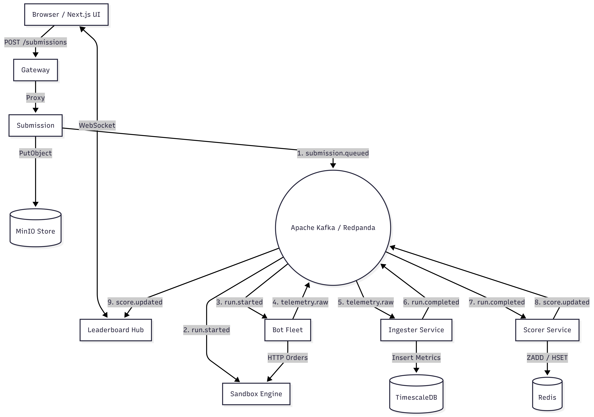

# TradeBench

   -E2231A?logo=apachekafka&logoColor=white)      

> **TradeBench** is a distributed benchmarking platform for trading infrastructure. Submit your orderbook or matching engine as source code, and it gets sandboxed in a **gVisor-hardened container**, hammered by a bot fleet at **1000+ RPS**, measured with **nanosecond-precision HDR Histograms**, and ranked on a **live WebSocket leaderboard** scored on latency, throughput, and order-book correctness.

🔗 **Live**: [tradebench.sudolife.in](https://tradebench.sudolife.in/)

---

## System Architecture

The system features a **100% event-driven, decoupled architecture**. There are zero synchronous HTTP calls between internal services - all inter-service communication is asynchronous via Kafka (Redpanda).



### Key Design Decisions
- **Event-Driven Pipeline**: 7 independent microservices communicate exclusively through Kafka topics. A Scorer crash doesn't halt telemetry ingestion; services fail and scale independently.
- **gVisor Sandboxing**: Contestant binaries are untrusted. gVisor's Sentry process intercepts every syscall in userspace, all Linux capabilities are dropped, and containers run on an isolated network with no internet access.
- **HDR Histograms over Averages**: Averages mask tail behaviour. HDR Histograms (1 ns – 10 s range, 3 significant figures) provide accurate p50/p90/p99/p99.9 latencies with allocation-free, lock-free recording - zero GC pressure during runs.
- **Redis `ZADD GT`**: Leaderboard scores are updated atomically with the `GT` flag - no read-modify-write cycles, no application-level locking, no race conditions.
- **Correctness Validation**: An engine that fills orders at the wrong price is incorrect regardless of speed. The Ingester replays orders chronologically against an in-memory order book to validate every fill.

## Microservices

| Service         | Responsibility                                                                     |
| --------------- | ---------------------------------------------------------------------------------- |
| **Gateway**     | JWT auth, tiered rate limiting (100 RPM global, 10 RPM submissions), reverse proxy |
| **Submission**  | MIME validation, SHA-256 hashing, MinIO storage, Kafka publish                     |
| **Sandbox**     | gVisor container provisioning - 2 vCPU, 512 MB, 256 PID limit, no network          |
| **Bot Fleet**   | Distributed load generation - goroutine worker pool at target RPS                  |
| **Ingester**    | HDR histogram aggregation, TimescaleDB persistence, correctness replay             |
| **Scorer**      | Composite score computation → Redis `ZADD GT`                                      |
| **Leaderboard** | WebSocket fan-out hub, Top-50 snapshot on connect, incremental updates             |
| **Frontend**    | Next.js 16 / React 19 / Tailwind 4 - live leaderboard + submission portal          |

## Kafka Topic Pipeline

```
Submission ──► submission.queued ──► Sandbox ──► run.started ──► Bot Fleet
                                                                    │
                                                            telemetry.raw
                                                                    │
                                                                    ▼
Leaderboard ◄── score.updated ◄── Scorer ◄── run.completed ◄── Ingester
```

| Topic               | Producer → Consumer  | Purpose                                   |
| ------------------- | -------------------- | ----------------------------------------- |
| `submission.queued` | Submission → Sandbox | Triggers container provisioning           |
| `run.started`       | Sandbox → Bot Fleet  | Signals bots to begin load generation     |
| `telemetry.raw`     | Bot Fleet → Ingester | 500-event batches, nanosecond timestamps  |
| `run.completed`     | Ingester → Scorer    | All telemetry persisted, metrics computed |
| `score.updated`     | Scorer → Leaderboard | Composite score after `ZADD GT`           |

## Scoring Formula

```
Final Score = (Latency × 0.35  +  Throughput × 0.35  +  Correctness × 0.30) × 100
```

| Component   | Weight | Formula                         | Optimise for |
| ----------- | ------ | ------------------------------- | ------------ |
| Latency     | 35%    | `max(0, (500ms − p99) / 500ms)` | Lower p99    |
| Throughput  | 35%    | `min(1.0, TPS / 1000)`          | Higher TPS   |
| Correctness | 30%    | `valid_fills / total_fills`     | Accuracy     |

> Correctness carries 30% weight to prevent a fast-but-incorrect engine from dominating.

## Tech Stack

- **Backend**: Go 1.26 - all 7 microservices (stdlib `net/http`, no frameworks)
- **Frontend**: Next.js 16, Framer Motion
- **Broker**: Redpanda (Kafka-compatible) - log replayability, sequential writes
- **Time-series**: TimescaleDB (PostgreSQL) - Hypertables, `time_bucket()`, continuous aggregates
- **Cache**: Redis - sorted sets for leaderboard (`ZADD GT`)
- **Object Storage**: MinIO (S3-compatible) - contestant binary storage
- **Sandbox**: Docker + gVisor (`runsc`) - syscall-level isolation
- **Telemetry**: HDR Histograms - 1 ns to 10 s range, 3 significant figures
- **Images**: `gcr.io/distroless/static` - near-zero CVE surface
- **IaC**: Terraform (GKE / DigitalOcean), Helm charts per service
- **CI/CD**: GitHub Actions - build, lint, test, Docker image builds

## Deployment

TradeBench runs on a hybrid cloud deployment:

- **Backend**: All 7 Go microservices + infrastructure (Redpanda, TimescaleDB, Redis, MinIO) are deployed on an **Azure Linux VM** via Docker Compose orchestration. The VM runs the full event-driven pipeline end-to-end.
- **Frontend**: The Next.js dashboard is deployed to **Vercel** for edge-optimised delivery with automatic SSL and CDN.
- **DNS & Routing**: The live site at [tradebench.sudolife.in](https://tradebench.sudolife.in/) routes to Vercel, which proxies API/WebSocket traffic to the Azure backend.
- **Container Images**: All service Dockerfiles use multi-stage builds - `golang:1.26-alpine` builder → `gcr.io/distroless/static` runtime (no shell, no package manager).
- **Sandbox Base Image**: `ubuntu:22.04` with gVisor `runsc` binary installed - used as the runtime for contestant code.

## Supported Languages

| Language | Submit as       | Notes                         |
| -------- | --------------- | ----------------------------- |
| Python   | `.py` source    | Runs via `python3` in sandbox |
| Go       | Compiled binary | Statically linked recommended |
| C++      | Compiled binary | Built against Ubuntu 22.04    |
| Rust     | Compiled binary | `musl` target recommended     |

Your bot must expose `GET /health` (→ 200), `GET /orders` (→ JSON), and `POST /orders` (→ fill result).

## Quick Start

```bash
git clone https://github.com/Akshitguptaa/TradeBench.git
cd TradeBench

# Start the full stack
make up

# Verify health
make smoke

# Seed sample bots
bash sample/seed.sh
```

## Performance

| Metric                   | Value                                                     | Source                                                                  |
| ------------------------ | --------------------------------------------------------- | ----------------------------------------------------------------------- |
| Telemetry precision      | 1 nanosecond                                              | `time.Now().UnixNano()` in `bots/internal/bot/bot.go`                   |
| Histogram range          | 1 ns – 10 s, 3 significant figures                        | `hdr.New(1, 10_000_000_000, 3)` in `ingester/internal/histogram/hdr.go` |
| Default target RPS       | 1,000 RPS (configurable via `BOT_DEFAULT_RPS`)            | `bots/config/config.go`                                                 |
| Default run duration     | 60 seconds (configurable via `BOT_DEFAULT_DURATION_SECS`) | `bots/config/config.go`                                                 |
| Kafka batch size         | 500 events per batch, 100 ms max timeout                  | `bots/internal/publisher/kafka.go`                                      |
| Completion grace window  | 2 extra seconds after run duration                        | `ingester/internal/window/window.go`                                    |
| Max concurrent sandboxes | 4 (configurable via `SANDBOX_MAX_CONCURRENT`)             | `sandbox/config/config.go`                                              |
| Connection reuse         | `MaxIdleConnsPerHost: 100`                                | `bots/internal/bot/bot.go`                                              |

## Contributing

Contributions are welcome! Please feel free to submit a Pull Request.

## License

Apache-2.0 License. See [LICENSE](LICENSE) for more information.
